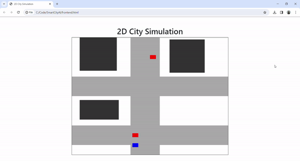

# SmartCityAI

Traffic Management System: This is an AI-powered traffic management system that uses real-time data from sensors, cameras, and other sources to optimize traffic flow, reduce congestion, and minimize travel time for commuters. 
Purpose of the system: to dynamically adjust traffic signals, reroute vehicles, and provide predictive analytics to anticipate traffic patterns.

